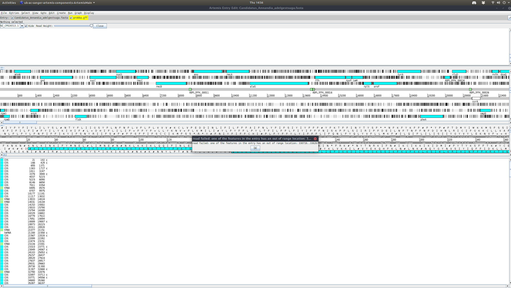
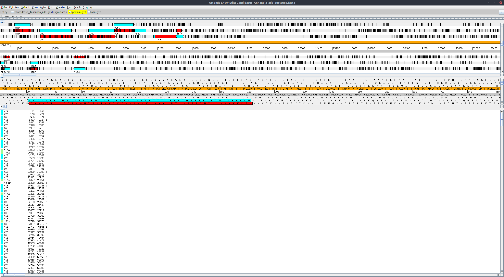

# README

These are some scripts that I use to perform biological analysis.

## Table Of Contents
1. [GC Calculator](#gc.py)
2. [Forking](#forking.pl)
3. [Blast Tables](#blast_parse.py)
4. [Annotation to Alignment](#annotation_to_alignment.py)

## GC Calculator <a name = "gc.py"></a>

`gc.py` gives you node name, length, and gc content (in \%) separated by spaces.

To run this script simply pass `gc.py` your `.fasta` or `.fastq` file and a
`gc_content.csv` will be written to the working directory.

```{bash}
python3 gc.py scaffolds.fasta
```

## General Forking Script <a name = "forking.pl"></a>

This is a very simple forking script for use with a compute cluster (not that
you can't use it locally). To use the scblast_parse.pyript you will have to edit some of the
values and then it should execute fine.

- `$max_cpu`
  - This value helps to set the maximum number of child process that will be
    run at any given time
- `$type`
  - This value tells the program what file type you want to use
  - As this is a simpler forking script it only currently accepts one file
    type, but can easily be expanded to multiple types
- `system ""`
  - Enter the command you would normally type into the bash shell in between
    the quotes ("")

```{perl}
my $mac_cpu = "3";
my $type = "*.gtk"
system "python3 ~/pseudofinder.py annotate -g $file -op pseudo_$file
  -db nr -t 4"
```

## Blast Parse <a name = "blast_parse.py"></a>

This script takes a blast output file as its input and outputs a 
`parsed_blast.txt` file. This new text file containes summary tables
for all nodes that had any significant hits.

To run this script simply pass `gc.py` your `.fasta` or `.fastq` file and a
`gc_content.csv` will be written to the working directory.

To run this script pass `blast_parse.py` your blast output file and the output 
file will be generated in the working directory.

(Currently only tested with blastn output, may need adjustment for other 
blast types.)

```{bash}
python3 blast_parse.py blastn.out
```

## Annotation to Alignment <a name = "annotation_to_alignment.py"></a>

This script takes a `.sam` file and `.gff` file as input and outputs new `.sam` 
and `.gff` files.

Adjusts annotations for putative nodes so that they fit into the reference 
genome used while lining up with the putative nodes. Best viewed with 
[https://www.sanger.ac.uk/science/tools/artemis](artemis genome viewer). Script 
also automatically adds red color to putative node annotations.

(Only tested with bwa alignment and prokka annotations so far.)

```{bash}
python3 putative_vs_reference.sam prokka.gff
```



